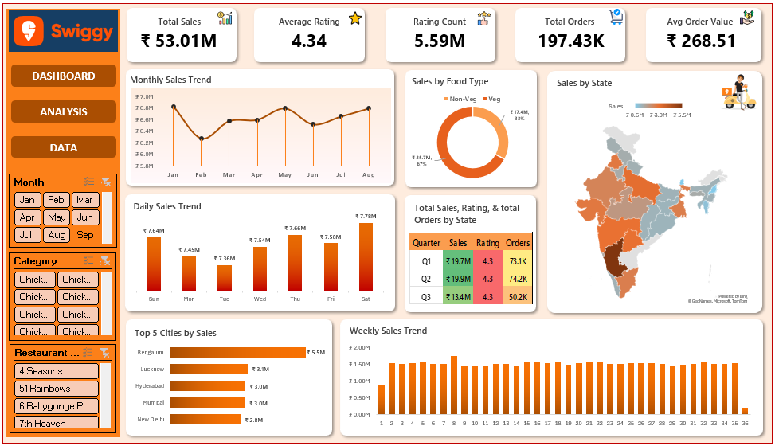

## Swiggy Sales & Performance Dashboard | Excel Project

## Overview
This project analyzes Swiggy sales data to understand revenue trends, customer behavior, and regional performance. The Dashboard was built using Microsoft Excel with Pivot Tables, Pivot Charts, and slicers to create interactive visualizations.

## Dashboard

## Key Analysis
- Monthly, weekly, daily, and quarterly sales trends.
- Veg vs Non-Veg order comparison
- State-wise sales performance
- Top 5 cities by revenue

## Tools Used
- Microsoft Excel
- Pivot Tables
- Pivot Charts
- Data Cleaning & Preparation

## Conclusion
The dashboard helps understand sales trends, customer preferences, and regional performance, providing clear insights for better business decisions.
